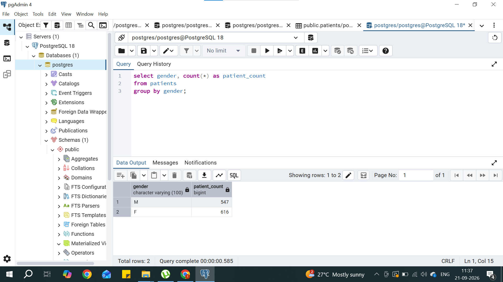

# Healthcare SQL Analysis
Analysis of synthetic patient data (Synthea) using PostgreSQL, covering 
patient demographics, condition prevalence, healthcare costs, and utilization patterns.

## Dataset
- 1,163 patients
- 61,459 encounters
- 38,094 conditions
- 17,009 immunizations
- Source: [Synthea Synthetic Patient Generator](https://synthea.mitre.org/)

## Tools Used
PostgreSQL, pgAdmin

## Key Questions & Findings

### 1. Gender distribution of patients
\`\`\`sql
SELECT gender, COUNT(*) AS patient_count
FROM patients
GROUP BY gender;
\`\`\`
**Finding:** Total no. of male patients are 547 and female patients are 616"

### 2. Top 10 most common conditions
\`\`\`sql
SELECT description, COUNT(*) AS condition_count
FROM conditions
GROUP BY description
ORDER BY condition_count DESC
LIMIT 10;
\`\`\`
**Finding:** [top condition and count]

