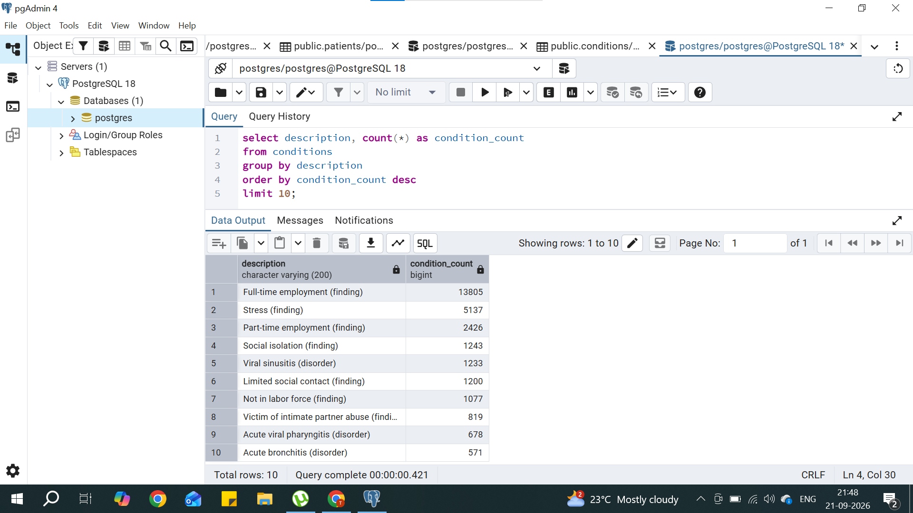
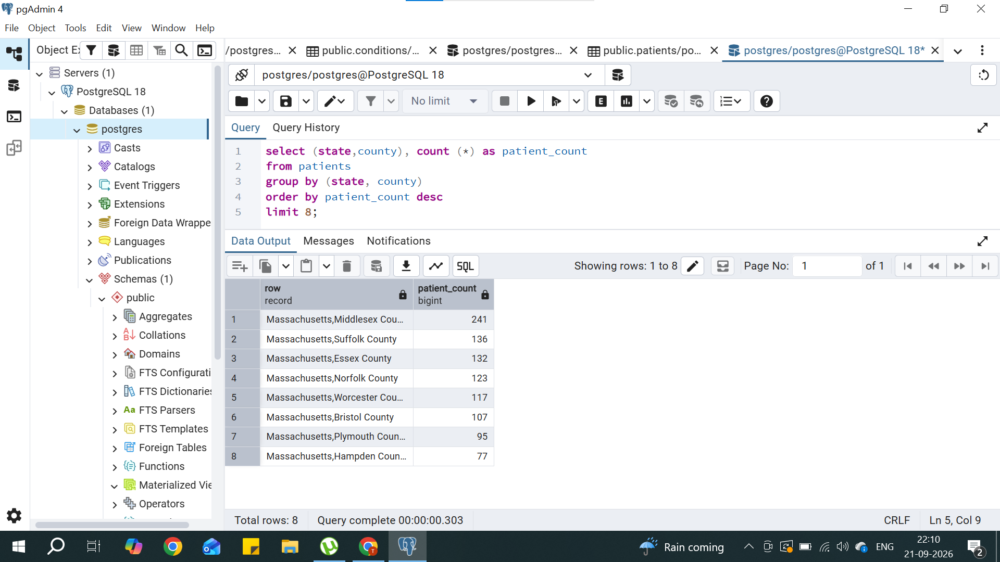
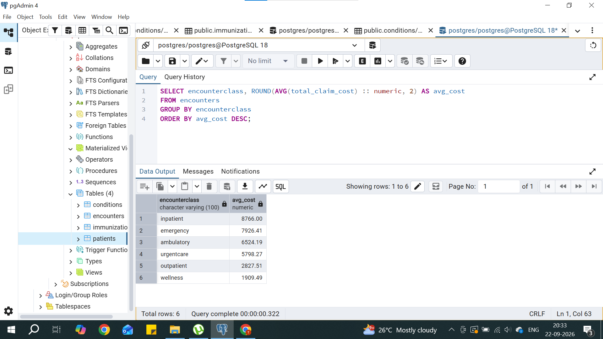

# Healthcare SQL Analysis
Analysis of synthetic patient data (Synthea) using PostgreSQL, covering 
patient demographics, condition prevalence, healthcare costs, and utilization patterns.

## Dataset
- 1,163 patients
- 61,459 encounters
- 38,094 conditions
- 17,009 immunizations
- Source: [Synthea Synthetic Patient Generator](https://synthea.mitre.org/)

## Tools Used
PostgreSQL, pgAdmin

## Key Questions & Findings

### 1. Gender distribution of patients
\`\`\`sql
SELECT gender, COUNT(*) AS patient_count
FROM patients
GROUP BY gender;
\`\`\`
**Finding:** Total no. of male patients are 547 and female patients are 616"

### 2. Top 10 most common conditions
\`\`\`sql
SELECT description, COUNT(*) AS condition_count
FROM conditions
GROUP BY description
ORDER BY condition_count DESC
LIMIT 10;
\`\`\`
**Finding:** The "conditions" table captures both medical diagnoses and social/ behavioral findings. The most frequently recorded entry was "Full-time employment (finding)" with 13,805 occurrences, followed by "Stress (finding)" 
(5,137) and "Part-time employment (finding)" (2,426). Among actual medical diagnoses, "Viral sinusitis (disorder)" was most common (1,233 cases), followed by "Acute viral pharyngitis" (678) and "Acute bronchitis" (571) 

### 3. State/county with most patients
\`\`\`sql
SELECT state, county, COUNT(*) AS patient_count
FROM patients
GROUP BY state, county
ORDER BY patient_count DESC
LIMIT 8;
\`\`\`
**Findings:** All top patient locations were in Massachusetts, indicating this synthetic dataset is centered on that state. Middlesex County had the most patients (241), followed by Suffolk County (136) and Essex County (132). The remaining counties in the top 8 - Norfolk, Worcester, Bristol, Plymouth, and Hampden - ranged between 77 and 123 patients each.

### 4. Average total_claim_cost by encounterclass
\`\`\sql
SELECT encounterclass, ROUND(AVG(total_claim_cost) :: numeric, 2) AS avg_cost
FROM encounters
GROUP BY encounterclass
ORDER BY avg_cost DESC;
\`\`\`
**Findings** Inpatient encounters had the highest average cost at $8,766.00, followed by emergency visits at $7,926.41. Ambulatory ($6,524.19) and urgent care ($5,798.27) encounters were moderately priced, while outpatient ($2,827.51) and wellness visits ($1,909.49) were the least expensive. This pattern aligns with expected healthcare cost trends - encounters requiring hospitalization or emergency intervention cost significantly more than routine or preventive care visits.

