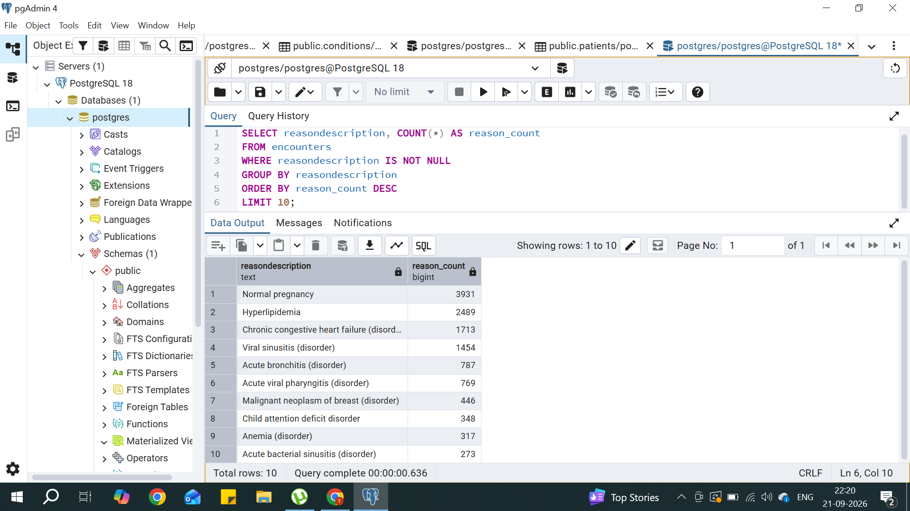
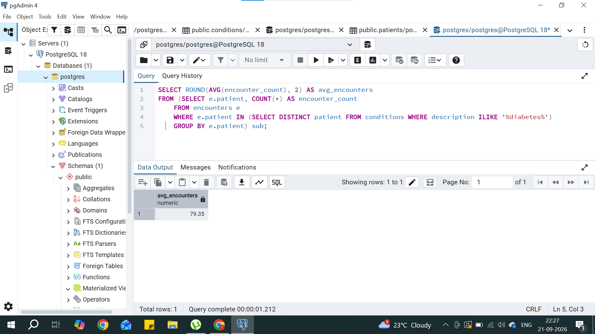
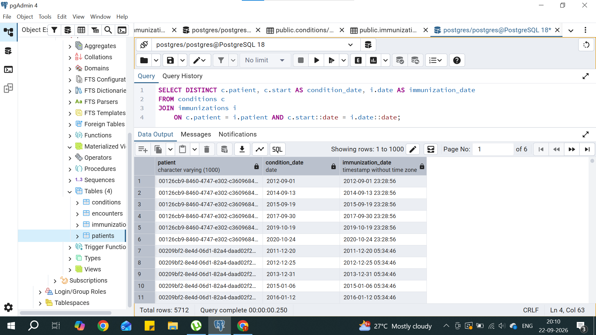
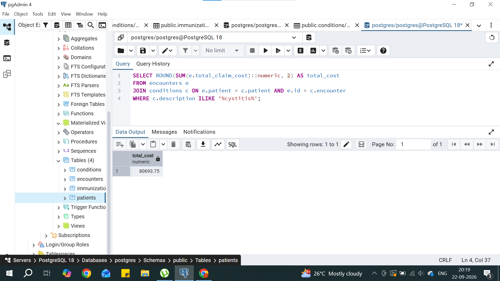
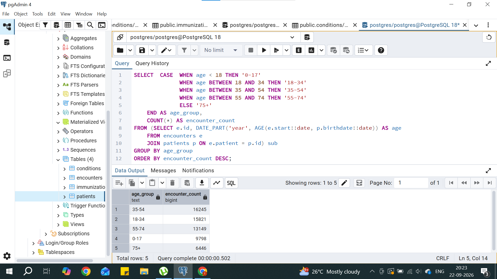

# Healthcare SQL Analysis
Analysis of synthetic patient data (Synthea) using PostgreSQL, covering 
patient demographics, condition prevalence, healthcare costs, and utilization patterns.

## Dataset
- 1,163 patients
- 61,459 encounters
- 38,094 conditions
- 17,009 immunizations
- Source: [Synthea Synthetic Patient Generator](https://synthea.mitre.org/)

## Tools Used
PostgreSQL, pgAdmin

## Key Questions & Findings

### 1. Gender distribution of patients
\`\`\`sql
SELECT gender, COUNT(*) AS patient_count
FROM patients
GROUP BY gender;
\`\`\`
**Finding:** Total no. of male patients are 547 and female patients are 616"

### 2. Top 10 most common conditions
\`\`\`sql
SELECT description, COUNT(*) AS condition_count
FROM conditions
GROUP BY description
ORDER BY condition_count DESC
LIMIT 10;
\`\`\`
**Finding:** The "conditions" table captures both medical diagnoses and social/ behavioral findings. The most frequently recorded entry was "Full-time employment (finding)" with 13,805 occurrences, followed by "Stress (finding)" 
(5,137) and "Part-time employment (finding)" (2,426). Among actual medical diagnoses, "Viral sinusitis (disorder)" was most common (1,233 cases), followed by "Acute viral pharyngitis" (678) and "Acute bronchitis" (571) 

### 3. State/county with most patients
\`\`\`sql
SELECT state, county, COUNT(*) AS patient_count
FROM patients
GROUP BY state, county
ORDER BY patient_count DESC
LIMIT 8;
\`\`\`
**Findings:** All top patient locations were in Massachusetts, indicating this synthetic dataset is centered on that state. Middlesex County had the most patients (241), followed by Suffolk County (136) and Essex County (132). The remaining counties in the top 8 - Norfolk, Worcester, Bristol, Plymouth, and Hampden - ranged between 77 and 123 patients each.

### 4. Average total_claim_cost by encounterclass
\`\`\`sql
SELECT encounterclass, ROUND(AVG(total_claim_cost) :: numeric, 2) AS avg_cost
FROM encounters
GROUP BY encounterclass
ORDER BY avg_cost DESC;
\`\`\`
**Findings:** Inpatient encounters had the highest average cost at $8,766.00, followed by emergency visits at $7,926.41. Ambulatory ($6,524.19) and urgent care ($5,798.27) encounters were moderately priced, while outpatient ($2,827.51) and wellness visits ($1,909.49) were the least expensive. This pattern aligns with expected healthcare cost trends - encounters requiring hospitalization or emergency intervention cost significantly more than routine or preventive care visits.

### 5. Most common reasondescription for encounters
\`\`\`sql
SELECT reasondescription, COUNT(*) AS reason_count
FROM encounters
WHERE reasondescription IS NOT NULL
GROUP BY reasondescription
ORDER BY reason_count DESC
LIMIT 10;
\`\`\`
**Findings:** "Normal pregnancy" was the most common reason for encounters (3,931 cases), followed by "Hyperlipidemia" (2,489) and "Chronic congestive heart failure" (1,713). Respiratory conditions such as viral sinusitis (1,454) and acute bronchitis (787) also featured prominently, showing a mix of routine maternity care and chronic disease management driving encounter volume.

### 6. Average encounters for patients with diabetes
\`\`\`sql
SELECT ROUND(AVG(encounter_count), 2) AS avg_encounters
FROM(SELECT e.patient, COUNT(*) AS encounter_count
FROM encounters e
WHERE e.patient IN (SELECT DISTINCT patient FROM conditions WHERE description ILIKE '%diabetes%')
GROUP BY e.patient) sub;
\`\`\`
**Findings:** Patients diagnosed with diabetes had an average of 79.35 encounters each — significantly higher than what would be expected for a general patient, reflecting the ongoing monitoring, management, and complications typically associated with chronic conditions like diabetes.

### 7. Patients with both a condition and immunization on the same day
\`\`\`sql
SELECT DISTINCT c.patient, c.start AS condition_date, i.date AS immunization_date
FROM conditions c
JOIN immunizations i 
ON c.patient = i.patient AND c.start = i.date;
\`\`\`
**Findings:** 5,712 instances were found where a patient had both a condition diagnosis and an immunization recorded on the same date, suggesting these were often combined visits — for example, a routine check-up where both a new diagnosis and a scheduled vaccination occurred together.

### 8. Total cost of encounters linked to cystitis
\`\`\`sql
SELECT ROUND(SUM(e.total_claim_cost)::numeric, 2) AS total_cost
FROM encounters e
JOIN conditions c ON e.patient = c.patient AND e.id = c.encounter
WHERE c.description ILIKE '%cystitis%';
\`\`\`
**Findings:** Encounters associated with a cystitis diagnosis totaled $80,693.75 in claim costs across the dataset, reflecting the cumulative cost of treating this common urinary tract condition among the patient population.

### 9. Age group with highest number of encounters
\`\`\`sql
SELECT 
    CASE 
        WHEN age < 18 THEN '0-17'
        WHEN age BETWEEN 18 AND 34 THEN '18-34'
        WHEN age BETWEEN 35 AND 54 THEN '35-54'
        WHEN age BETWEEN 55 AND 74 THEN '55-74'
        ELSE '75+'
    END AS age_group,
    COUNT(*) AS encounter_count
FROM (
    SELECT e.id, DATE_PART('year', AGE(e.start::date, p.birthdate::date)) AS age
    FROM encounters e
    JOIN patients p ON e.patient = p.id
) sub
GROUP BY age_group
ORDER BY encounter_count DESC;
\`\`\`
**Findings:** The 35-54 age group had the highest number of encounters (16,245), closely followed by 18-34 (15,821) and 55-74 (13,149). Encounters were lowest among the 75+ age group (6,446), likely reflecting a smaller population size in that bracket. This suggests working-age and middle-aged adults account for the bulk of healthcare utilization in this dataset.

